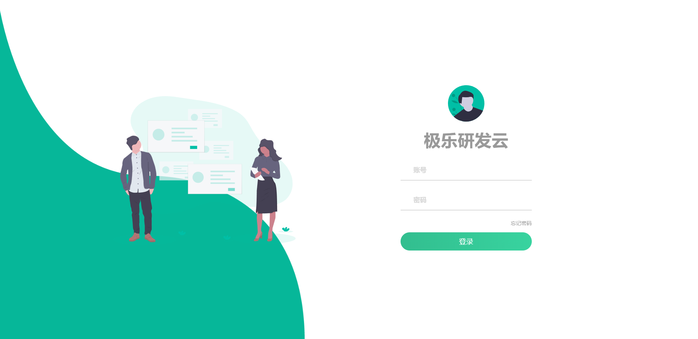

# 新登录页面



有好事之徒嫌之前登录页面丑, 而我也没能力设计出一个漂亮的登录页面, 因此去B站找了个过来改造: [原项目地址](https://github.com/ramostear/login-page-01), 如果打不开 可以点 [这个地址](https://hub.fastgit.org/ramostear/login-page-01)

## 搬迁素材

把该项目下的素材图片(img目录下)搬迁到我们的: src/assets/login 下面:
+ avatar.svg
+ bg.png
+ img-3.svg

## 搬迁HTML

原项目下的HTML文件为: login.html, 我们将他搬迁到我们 login组件的模板里面来: src/views/keyauth/login/new.vue

有几处需要调整:
+ img标签的src 替换为 @/assets/login/xxx.png
+ 之前的英文文案换成中文
+ input组件使用 v-model 绑定我们之前的数据
+ 替换掉之前的btn按钮, 使用之前的el-button, 但是样式使用它的样式

```html
<template>
<div class="login-container">
    
    <div class="container">
        <div class="img">
            
        </div>
        <div class="login-box">
            <form action="">
                
                <h2>极乐研发云</h2>
                <div class="input-group">
                    <div class="icon">
                        <i class="fa fa-user"></i>
                    </div>
                    <div>
                        <h5>账号</h5>
                        <input v-model="loginForm.username" type="text" class="input">
                    </div>
                </div>
                <div class="input-group">
                    <div class="icon">
                        <i class="fa fa-lock"></i>
                    </div>
                    <div>
                        <h5>密码</h5>
                        <input v-model="loginForm.password" type="password" class="input">
                    </div>
                </div>
                <a href="#">忘记密码</a>
                <!-- 提交表单 -->
                <!-- 这里替换成原来的el-button, 只是样式使用该项目的样式: class login-btn --> btn
                <el-button class="btn" :loading="loading" tabindex="3" size="medium" type="primary" @click="handleLogin">
                    登录
                </el-button>
            </form>
        </div>
    </div>
</div>
</template>
```

## 搬迁CSS

原来项目的css文件放置于: css/style.css, 我们将它搬迁到 组件目录下: src/views/keyauth/login/style.scss

它的样式我们不做调整直接使用: [style.css](https://hub.fastgit.org/ramostear/login-page-01/blob/master/css/style.css)

然后在我们组件内部引入

```html
<style lang="scss" scoped>
@import './style.scss';
</style>
```

## 搬迁Js

原项目的Js处理很简单, 核心就是添加focus和blur的事件处理:
```js
const inputs = document.querySelectorAll(".input");

function focusFunction(){
    let parentNode = this.parentNode.parentNode;
    parentNode.classList.add('focus');
}
function blurFunction(){
    let parentNode = this.parentNode.parentNode;
    if(this.value == ''){
        parentNode.classList.remove('focus');
    }
}

inputs.forEach(input=>{
    input.addEventListener('focus',focusFunction);
    input.addEventListener('blur',blurFunction);
});
```

我们将他搬迁到 new.vue里面的一个方法里面
```js
addEventHandler() {
    const inputs = document.querySelectorAll(".input");

    function focusFunction(){
        let parentNode = this.parentNode.parentNode;
        parentNode.classList.add('focus');
    }
    function blurFunction(){
        let parentNode = this.parentNode.parentNode;
        if(this.value == ''){
            parentNode.classList.remove('focus');
        }
    }

    inputs.forEach(input=>{
        input.addEventListener('focus',focusFunction);
        input.addEventListener('blur',blurFunction);
    });  
},
```

最后再页面加载完成后调用:
```js
mounted() {
    this.addEventHandler()
},
```

## 切换路由到新登录页面

修改我们路由: router/index.js, 让其指向新的登录视图
```js
{
path: "/login",
name: "Login",
component: () =>
    import("../views/keyauth/login/new.vue"),
},
```


到此我们基础的搬迁工作就完成了, 剩下适配我们的登录逻辑了