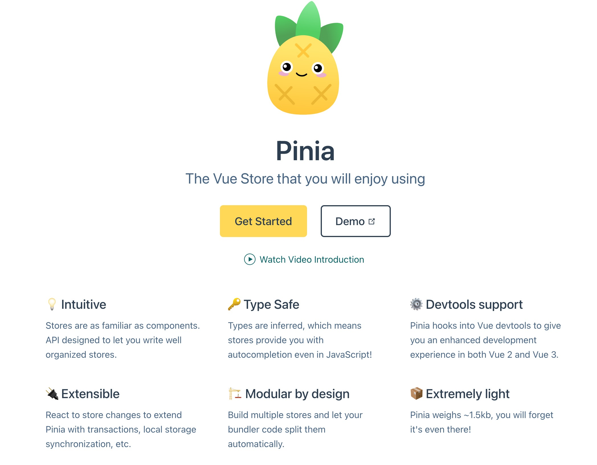

# Vue状态管理

举个简单的例子, 我们每个页面在访问后端数据的时候 都需要token, 那么所有组件都依赖token这个数据, 我们就需要找个地方存起来，让其他组件都能访问到它

通俗的讲，就是存储一些公用的东西，提供给各个组件使用，和服务器端的session功能也很类似

那我们如何来实现这个共享存储喃?

## 共享内存

第一种方式最直接: 共享内存, 直接开辟一个变量，全局都能访问到就可以了, 类似于后端的全局变量:

前面我们在讲组建通信的时候就使用过:
+ 注入依赖
+ 组合式函数

### 全局注入

使用到 provide() 函数注入到根实例, 从而提供全局变量功能
```vue
<script setup>
import { RouterLink, RouterView } from "vue-router";
import HelloWorld from "@/components/HelloWorld.vue";

import { ref, provide } from "vue";
// 如果的变量可以是响应式的
const count = ref(0);
provide(/* 注入名 */ "count", /* 值 */ count);
</script>
```

通过inject获取父组件注入的变量:
```vue
<script setup>
import { inject } from "vue";

// 这里也可以获取默认值: inject(<变量名称>, <变量默认值>), 如果获取不到变量 就使用默认值
const count = inject("count");

const doClick = () => {
  count.value++;
};
</script>

<template>
  <button @click="doClick">You clicked me {{ count }} times.</button>
</template>
```

### 组合式函数

声明一个响应式模块，导出后，提供给所有组件使用
```js
// store/global.js
import { reactive } from "vue";

export const store = reactive({
  count: 0,
});
```

其他组件通过js的导入语法直接使用，妥妥的全局变量
```vue
<script setup>
import { store } from "@/stores/global";

const doClick = () => {
  store.count++;
};
</script>

<template>
  <button @click="doClick">You clicked me {{ store.count }} times.</button>
</template>
```

### 总结

这种其实就是一个简单粗暴的 通过共享内存进行通信的方式, 好在其简单易懂，也许你会喜欢, 但是也有它的缺陷

因为这种方式使用的是内存, 所以页面关闭或者刷新就都没有, 想要就状态持久化 还需要存储

## 浏览器本地存储

这种方式就需要使用到浏览器的存储功能了, 它可供我们存储客户端临时信息 简称 Web Storage


+ cookie
+ sessionStorage
+ localStorage

### cookie

cookie是有可以设置过期时间的, 同一个域下的页面都可以访问

cookie在没有设置过期时间时，系统默认浏览器关闭时失效，只有设置了没到期的保存日期时，浏览器才会把cookie作为文件保存在本地上。当expire到期时，cookie不会自动删除，仅在下次启动浏览器或者刷新浏览器时，浏览器会检测cookie过期时间，如已过期浏览器则会删除过期cookie

注意:
  + 数据存放大小: 4k, 因为每次http请求都会携带cookie
  + 浏览器关闭时， cookie会失效
  + 注意cookie可以支持httpOnly, 这个时候前端js是修改不了的(也看不到)

```js
// 读取cookie, 注意读取出来的cookie是个字符串
document.cookie
'language=zh; Sub-System=develop; sidebarStatus=1; Current-Namespace=c16mhsddrei91m4ri0jg; Refresh-Token=paBuyTIfsX3BeKrXrCmD8khUla6x8y1g'
// 需要自己处理
document.cookie.split('; ')

// 直接赋值就添加了一个key-value
document.cookie = 'cookieKey=cookieValue'
'language=zh; Sub-System=develop; sidebarStatus=1; Current-Namespace=c16mhsddrei91m4ri0jg; Refresh-Token=paBuyTIfsX3BeKrXrCmD8khUla6x8y1g; cookieKey=cookieValue'

// 当然cookie还有很多选项可以设置, 通过;隔开比如
document.cookie="username=John Doe; expires=Thu, 18 Dec 2043 12:00:00 GMT; path=/";

// 修改cookie和设置cookie一样, 保证key相同就可以
document.cookie = 'cookieKey=cookieValue2'
document.cookie
'language=zh; Sub-System=develop; sidebarStatus=1; Current-Namespace=c16mhsddrei91m4ri0jg; Refresh-Token=paBuyTIfsX3BeKrXrCmD8khUla6x8y1g; cookieKey=cookieValue2'

// 删除cookie时，把expires 设置到过期的时间即可, 比如设置个2019年的时间
document.cookie = `cookieKey=;expires=Mon, 26 Aug 2019 12:00:00 UTC`
document.cookie
'language=zh; Sub-System=develop; sidebarStatus=1; Current-Namespace=c16mhsddrei91m4ri0jg; Refresh-Token=paBuyTIfsX3BeKrXrCmD8khUla6x8y1g'
```

### sessionStorage

存储的数据只有在同一个会话中的页面才能访问并且当会话结束后数据也随之销毁, 因此sessionStorage不是一种持久化的本地存储，仅仅是会话级别的存储

那么，到底什么是一个会话？多个标签页之间的数据是否会共享呢？

> 我们可以验证下: 开启2个窗口, 直接通过浏览器修改sessionStorage 进行验证

通过验证我们可以知道 一个标签页 就表示一个回话, 当标签页关闭, 回话就清除,  不通标签页之间不共享数据

```js
// 通过setItem设置key-value
sessionStorage.setItem('key1', 'value1')
sessionStorage['key2']= 'value2'
sessionStorage.key2= 'value2'

// 查询sessionStorage对象
sessionStorage
Storage {key2: 'value2', key1: 'value1', length: 2}

// 通过getItem获取key的值
sessionStorage.getItem('key1')
sessionStorage['key1']
sessionStorage.key1

// 修改
sessionStorage.key1 = 'value11'
sessionStorage['key1'] = 'value11'

// 删除key
sessionStorage.removeItem('key1')

// 清空storage
sessionStorage.clear()
```

### localStorage

localStorage生命周期是永久, 除非主动删除数据，否则数据是永远不会过期的

相同浏览器的不同页面间可以共享相同的 localStorage（页面属于相同域名和端口）

> 我们可以验证下: 开启2个窗口, 直接通过浏览器修改localStorage 进行验证

localStorage的操作方法和sessionStorage完全一样:

```js
// 通过setItem设置key-value
localStorage.setItem('key1', 'value1')
localStorage['key2']= 'value2'
localStorage.key2 = 'value2'

// 查询sessionStorage对象
localStorage
Storage {key2: 'value2', key1: 'value1', length: 2}

// 通过getItem获取key的值
localStorage.getItem('key1')
localStorage['key1']
localStorage.key1

// 修改
localStorage.key1 = 'value11'
localStorage['key1'] = 'value11'

// 删除key
localStorage.removeItem('key1')

// 清空storage
localStorage.clear()
```

## Vueuse与本地存储

作为vue3的标准库, vueuse提供了很多实用的工具来实现了状态管理, 其他就有保护浏览器存储的组合式API函数:
[Vueuse State相关工具](https://vueuse.org/functions.html#category=State)

在vueuse中有一个高频使用的函数: useStorage, 就默认就是使用的LocalStorage, 该函数已经讲LocalStroage包装成了响应式了, 
因此你可以把他理解为一个带有持久化机制的响应式对象

下面是useStorage的基础用法:
```js
import { useStorage } from '@vueuse/core'

// bind object
const state = useStorage('my-store', { hello: 'hi', greeting: 'Hello' })

// bind boolean
const flag = useStorage('my-flag', true) // returns Ref<boolean>

// bind number
const count = useStorage('my-count', 0) // returns Ref<number>

// bind string with SessionStorage
const id = useStorage('my-id', 'some-string-id', sessionStorage) // returns Ref<string>

// delete data from storage
state.value = null
```

我们集合前面讲到共享内存的通信方式, 把他们改造成, 结合本地存储基础, 从而避免刷新页面是状态丢失:
+ 注入依赖
+ 组合式函数

### 注入依赖持久化

直接使用useStorage构造一个响应式持久化变量:
```vue
<script setup>
import { RouterLink, RouterView } from "vue-router";
import { useStorage } from '@vueuse/core'
import HelloWorld from "@/components/HelloWorld.vue";

import { provide } from "vue";
// 如果的变量可以是响应式的
const count = useStorage('count', 0);
provide(/* 注入名 */ "count", /* 值 */ count);


// 这里也可以获取默认值: inject(<变量名称>, <变量默认值>), 如果获取不到变量 就使用默认值
// const count = inject("count");
</script>
```

### 全局变量持久化

声明一个响应式模块，导出后，提供给所有组件使用
```js
// store/global.js
import { useStorage } from '@vueuse/core'

export const store = useStorage('count', 0);

// 通过 state.value 可以访问到该全局变量
```

## pinia

虽然我们的手动状态管理解决方案在简单的场景中已经足够了，但是在大规模的生产应用中还有很多其他事项需要考虑：

+ 更强的团队协作约定
+ 与 Vue DevTools 集成，包括时间轴、组件内部审查和时间旅行调试
+ 模块热更新 (HMR)
+ 服务端渲染支持

Pinia 就是一个实现了上述需求的状态管理库，由 Vue 核心团队维护，对 Vue 2 和 Vue 3 都可用



### vuex与pinia

Pinia 最初正是为了探索 Vuex 的下一个版本而开发的，
因此整合了核心团队关于 Vuex 5 的许多想法。最终，我们意识到 Pinia 已经实现了我们想要在 Vuex 5 中提供的大部分内容，因此决定将其作为新的官方推荐

相比于 Vuex，Pinia 提供了更简洁直接的 API，并提供了组合式风格的 API，最重要的是，在使用 TypeScript 时它提供了更完善的类型推导

下面是使用组合式API定义的一个store
```js
import { defineStore } from 'pinia'

// You can name the return value of `defineStore()` anything you want, but it's best to use the name of the store and surround it with `use` and `Store` (e.g. `useUserStore`, `useCartStore`, `useProductStore`)
// the first argument is a unique id of the store across your application
export const useStore = defineStore('main', {
  // other options...
})
```

### 基本概念

pinia遵循“单向数据流”这一概念, 流程如下:


+ 状态：驱动整个应用的数据源；
+ 视图：对状态的一种声明式映射, 视图层获取状态；
+ 交互：状态根据用户在视图中的输入而作出相应变更的可能方式, 通过actons来修改状态。

通过defineStore来声明一个状态管理模块, 从中也可以看出这3个核心概念:
```js
export const useCounterStore = defineStore('counter', {
  // 状态数据
  state: () => ({ count: 0, name: 'Eduardo' }),
  // 获取状态数据
  getters: {
    doubleCount: (state) => state.count * 2,
  },
  // 修改状态的数据
  actions: {
    increment() {
      this.count++
    },
  },
})
```

### 安装

当然你也可以选择手动安装:
```sh
yarn add pinia
# or with npm
npm install pinia
```

然后在项目中引入
```js
import { createApp } from 'vue'
import { createPinia } from 'pinia'
import App from './App.vue'

const pinia = createPinia()
const app = createApp(App)

app.use(pinia)
app.mount('#app')
```

当然更加简单的方法是 使用 cli安装, 还能给我们生成实例
```sh
vue add pinia
```

### 定义Store

选项式风格:
```js
export const useCounterStore = defineStore('counter', {
  state: () => ({ count: 0, name: 'Eduardo' }),
  getters: {
    doubleCount: (state) => state.count * 2,
  },
  actions: {
    increment() {
      this.count++
    },
  },
})
```

pinia 很友好为我们提供了Setup风格, 这样整体代码可以保证统一的风格:
```js
export const useCounterStore = defineStore('counter', () => {
  const count = ref(0)
  const name = ref('Eduardo')
  const doubleCount = computed(() => count.value * 2)
  function increment() {
    count.value++
  }

  return { count, name, doubleCount, increment }
})
```

In Setup Stores:
+ ref()s become state properties
+ computed()s become getters
+ function()s become actions


### 使用Store

通过组合式函数方式直接使用
```js
import { useCounterStore } from '@/stores/counter'

export default {
  setup() {
    const store = useCounterStore()

    return {
      // you can return the whole store instance to use it in the template
      store,
    }
  },
}
```


> 测试下 看看devtools中 vuex是否正常, 看看刷新后如何

### 持久化存储

上面的测试应该已经知道 pinia的状态存储并不能持久化，存储在 Vuex 中的 store 里的数据，只要一刷新页面，数据就丢失了

那我们能不能叫pinia的存储修改为localstorage喃? 答案是可以的, 有个插件就完成了这个事儿: pinia-plugin-persist,具体使用说明请参考: [Pinia Plugin Persist](https://seb-l.github.io/pinia-plugin-persist/basic-usage.html)


#### 安装插件

```js
npm i pinia-plugin-persist --save
```

安装好了后我们配置vuex使用该插件： store/index.js
```js
// 1. 引入依赖
import piniaPersist from 'pinia-plugin-persist'

// 2.配置store实例使用piniaPersist插件
const pinia = createPinia()
pinia.use(piniaPersist)
```

这样我们持久化的插件就安装上了, 但是默认我们的state并没有持久化, 可以测试下

#### 使用插件

要开启state的持久化，在定义store的时候，传递一个参数:

```js
import { defineStore } from 'pinia'

export const useUserStore = defineStore('storeUser', {
  state: () => {
    return {
      firstName: 'S',
      lastName: 'L',
      accessToken: 'xxxxxxxxxxxxx'
    }
  },
  actions: {
    setToken (value: string) {
      this.accessToken = value
    }
  },
  persist: {
    enabled: true , // 这个配置代表存储生效，而且是整个store都存储
  }
})
```

注意插件默认使用的是: sessionStorage, 当然我们也可以自定义存储策略

#### 存储策略

```js
// store/use-user-store.ts
export const useUserStore = defineStore('storeUser', {
  state () {
    return {
      firstName: 'S',
      lastName: 'L',
      accessToken: 'xxxxxxxxxxxxx',
    }
  },
  persist: {
    enabled: true,
    strategies: [
      { storage: sessionStorage, paths: ['firstName', 'lastName'] }, // firstName 和 lastName字段用sessionStorage存储
      { storage: localStorage, paths: ['accessToken'] }, // accessToken字段用 localstorage存储
    ],
  },
```

## 参考

+ [Pinia Plugin Persist](https://seb-l.github.io/pinia-plugin-persist/basic-usage.html)
+ [cookies、sessionStorage和localStorage解释及区别](https://www.cnblogs.com/pengc/p/8714475.html)
+ [JavaScript Cookie](https://www.runoob.com/js/js-cookies.html)
+ [JavaScript创建、读取和删除cookie](https://www.jb51.net/article/169117.htm)