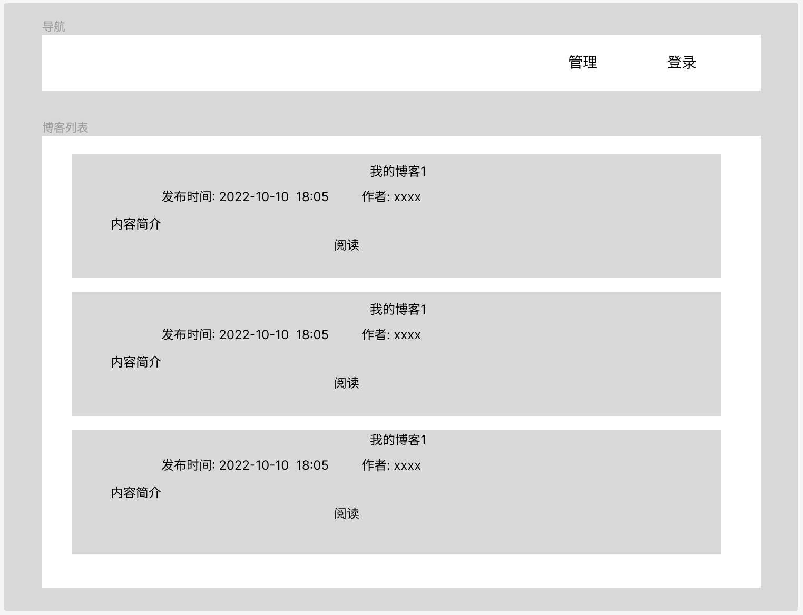
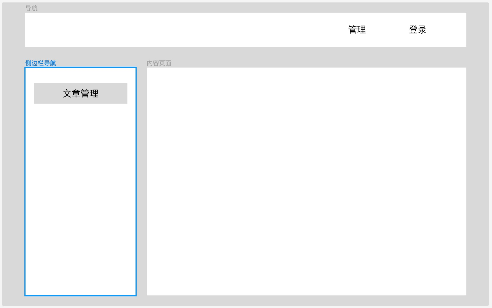

# 前端框架搭建

## 项目初始化

### 生成项目模版

这里我们直接使用vue cli 初始化我们的骨架, 然后在此基础上进行修改
```sh
npm init vue@latest
Need to install the following packages:
  create-vue@3.3.4
Ok to proceed? (y) y

Vue.js - The Progressive JavaScript Framework

✔ Project name: … vblog
✔ Add TypeScript? … No / Yes
✔ Add JSX Support? … No / Yes
✔ Add Vue Router for Single Page Application development? … No / Yes
✔ Add Pinia for state management? … No / Yes
✔ Add Vitest for Unit Testing? … No / Yes
✔ Add Cypress for both Unit and End-to-End testing? … No / Yes
✔ Add ESLint for code quality? … No / Yes
✔ Add Prettier for code formatting? … No / Yes

Scaffolding project in /Users/yumaojun/Workspace/Golang/go-course/extra/vblog...

Done. Now run:

  cd vblog
  npm install
  npm run lint
  npm run dev
```

### 设置项目源

检查源设置:
```sh
yrm ls

  npm ---- https://registry.npmjs.org/
  cnpm --- http://r.cnpmjs.org/
* taobao - https://registry.npm.taobao.org/
  nj ----- https://registry.nodejitsu.com/
  rednpm - http://registry.mirror.cqupt.edu.cn/
  npmMirror  https://skimdb.npmjs.com/registry/
  edunpm - http://registry.enpmjs.org/
  yarn --- https://registry.yarnpkg.com
```

如果不是，使用yrm use来进行切换
```sh
# 使用淘宝的源
> yrm use taobao
   YARN Registry has been set to: https://registry.npm.taobao.org/
   NPM Registry has been set to: https://registry.npm.taobao.org/
```

### 清理模版页面

在做Home页面之前，先清理掉脚手架为我们生成的页面

1. 清理App.vue, 只保留router试图部分, 其他部分删除掉
```vue
<script setup>
import { RouterView } from "vue-router";
</script>

<template>
  <RouterView />
</template>

<style scoped>
</style>
```

2. 只保留了HomeView, 内容留白:
```vue
<script setup></script>

<template>
  <main>Home</main>
</template>
```

3. 删除其他页面和无用的组件:
+ AboutView 删除
+ components 目录下的所有组件

4. 清理样式

base.css设置全局样式
```css
* {
  box-sizing: border-box;
}

html,
body {
  width: 100%;
  height: 100%;
  margin: 0;
  padding: 0;
  font-size: 14px;
  background-color: var(--color-bg-1);
  -moz-osx-font-smoothing: grayscale;
  -webkit-font-smoothing: antialiased;
}
```

main.css 只保留基础样式
```css
@import "./base.css";
```

## 安装UI插件

接下来就需要编写我们的业务页面, 这我们选择的UI组件为: Arco Design


### 安装 Arco Design

```sh
# npm
npm install --save-dev @arco-design/web-vue
# yarn
yarn add --dev @arco-design/web-vue
```

在vue安装该插件
```js
import { createApp } from 'vue'
import ArcoVue from '@arco-design/web-vue';
import App from './App.vue';
import '@arco-design/web-vue/dist/arco.css';

const app = createApp(App);
app.use(ArcoVue);
app.mount('#app');
```

### 验证插件

修改HomeView, 引入buttom UI组件进行测试
```vue
<script setup></script>

<template>
  <main>
    <a-space>
      <a-button type="primary">Primary</a-button>
      <a-button>Secondary</a-button>
      <a-button type="dashed">Dashed</a-button>
      <a-button type="outline">Outline</a-button>
      <a-button type="text">Text</a-button>
    </a-space>
  </main>
</template>
```

## 错误页面

这里我们需要补充2种异常页面:
+ 404页面: 当用户输入的URL并没有匹配页面时
+ 403页面: 当用户未登陆就访问管理页面时

我们使用[HTTP状态码 404](https://arco.design/vue/component/result)组件进行封装

### 404页面

errors/NotFound.vue:
```vue
<template>
  <div class="content">
    <a-result class="result" status="404" :subtitle="'not found'">
      <template #extra>
        <a-button key="back" type="primary" @click="back"> 返回主页 </a-button>
      </template>
    </a-result>
  </div>
</template>

<script setup>
import { useRouter } from "vue-router";

const router = useRouter();
const back = () => {
  // warning： Go to the node that has the permission
  router.push({ name: "home" });
};
</script>

<style scoped lang="less">
.content {
  position: absolute;
  top: 50%;
  left: 50%;
  margin-left: -95px;
  margin-top: -121px;
  text-align: center;
}
</style>
```

这里我们使用到了less, 一种css编译器(css扩展), 因此需要安装less的编译器
```sh
npm install --save-dev less
```

最后我们在路由上补充上404路由
```js
const router = createRouter({
  history: createWebHistory(import.meta.env.BASE_URL),
  routes: [
    {
      path: "/",
      name: "home",
      component: HomeView,
    },
    {
      path: "/:pathMatch(.*)*",
      name: "notFound",
      component: () => import("@/views/errors/NotFound.vue"),
    },
  ],
});
```

### 403页面

添加页面: errors/PermissionDeny.vue
```vue
<template>
  <div class="content">
    <a-result
      class="result"
      status="403"
      :subtitle="'你无权限访问该页面, 请登陆后重试'"
    >
      <template #extra>
        <a-button key="back" type="primary" @click="back"> 返回主页 </a-button>
      </template>
    </a-result>
  </div>
</template>

<script setup>
import { useRouter } from "vue-router";

const router = useRouter();
const back = () => {
  // warning： Go to the node that has the permission
  router.push({ name: "home" });
};
</script>

<style scoped lang="less">
.content {
  position: absolute;
  top: 50%;
  left: 50%;
  margin-left: -95px;
  margin-top: -121px;
  text-align: center;
}
</style>
```

补充路由:
```js
const router = createRouter({
  history: createWebHistory(import.meta.env.BASE_URL),
  routes: [
    {
      path: "/",
      name: "home",
      component: HomeView,
    },
    {
      path: "/errors/403",
      name: "PermissionDeny",
      component: () => import("@/views/errors/PermissionDeny.vue"),
    },
    {
      path: "/:pathMatch(.*)*",
      name: "NotFound",
      component: () => import("@/views/errors/NotFound.vue"),
    },
  ],
});
```

## Layout布局

界面分为前台和管理后台

博客前台:



博客管理后台:




## 参考 

