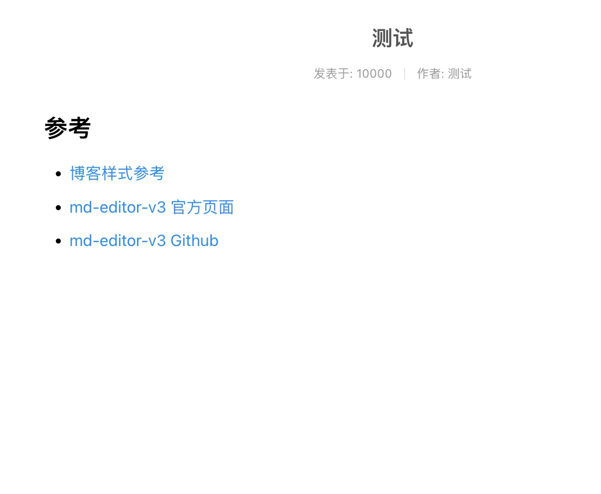

# 博客前台

## 博客列表


### 列表项组件

补充列表项组件: frontend/BlogItem.vue
```vue
<template>
  <div>
    <h2 class="title">
      {{ title }}
    </h2>
    <div class="describe">
      <div>发表于: {{ publishAt }}</div>
      <a-divider direction="vertical" />
      <div>作者: {{ author }}</div>
    </div>
    <div class="summary">
      {{ summary }}
    </div>
    <div class="more">
      <a-button size="mini" type="dashed">阅读全文 »</a-button>
    </div>
  </div>
</template>

<script setup>
defineProps({
  title: String,
  publishAt: Number,
  author: String,
  summary: String,
});
</script>

<style lang="less" scoped>
.title {
  display: flex;
  justify-content: center;
  align-items: center;
  align-content: center;
  color: #555;
}

.describe {
  display: flex;
  justify-content: center;
  align-items: center;
  align-content: center;
  color: #999;
  font-size: 12px;
}

.summary {
  color: #333;
  font-size: 14px;
  line-height: 1.6;
  margin: 10px 0 10px 0;
}

.more {
  display: flex;
  justify-content: center;
  align-items: center;
  align-content: center;
}
</style>
```

### 列表页

博客列表页: frontend/BlogView.vue
```vue
<script setup>
import BlogItem from "./BlogItem.vue";
</script>

<template>
  <div class="content">
    <a-space direction="vertical" style="width: 700px">
      <BlogItem
        title="测试"
        publishAt="1662978665"
        author="测试"
        summary="Java启动命令是所有java应用程序的入口，通过它来启动Java运行时环境，并加载相关的class。不过由于IDE的盛行，我们Java程序员中的大多数并不是非常的了解Java启动命令。本文希望做一个Java启动命令的汇总，和各位同道分享，也便于日后作为自己的参考"
      ></BlogItem>
      <BlogItem
        title="测试"
        publishAt="1662978665"
        author="测试"
        summary="测试"
      ></BlogItem>
      <BlogItem
        title="测试"
        publishAt="1662978665"
        author="测试"
        summary="测试"
      ></BlogItem>
    </a-space>
  </div>
</template>

<style lang="less" scoped>

.content {
  width: 100%;
}
</style>
```

## 博客详情页

由于博客是Markdown的, 所以我们需要选择一个支持Markdown编辑与展示的vue3的库: 这里选择使用[md-editor-v3](https://www.npmjs.com/package/md-editor-v3)



### md-editor-v3库介绍

安装md-editor-v3: 
```sh
npm i md-editor-v3
```

使用方法:
```vue
<template>
  <md-editor v-model="text" preview-only />
</template>

<script setup>
import { ref } from 'vue';
import MdEditor from 'md-editor-v3';
import 'md-editor-v3/lib/style.css';

const text = ref('# Hello Editor');
</script>
```

### 详情页组件

frontend/BlogDetail.vue

```vue
<template>
  <div>
    <h2 class="title">
      {{ title }}
    </h2>
    <div class="describe">
      <div>发表于: {{ publishAt }}</div>
      <a-divider direction="vertical" />
      <div>作者: {{ author }}</div>
    </div>
    <div style="width: 700px">
      <md-editor
        v-model="text"
        preview-only
        style="height: calc(100vh - 85px)"
      />
    </div>
  </div>
</template>

<script setup>
import { ref } from "vue";
import MdEditor from "md-editor-v3";
import "md-editor-v3/lib/style.css";

const title = "测试";
const publishAt = 10000;
const author = "测试";
const text = ref(`## 参考

+ [博客样式参考](http://www.arccode.net/)
+ [md-editor-v3 官方页面](https://imzbf.github.io/md-editor-v3/index)
+ [md-editor-v3 Github](https://github.com/imzbf/md-editor-v3)`);
</script>

<style lang="less" scoped>
.title {
  display: flex;
  justify-content: center;
  align-items: center;
  align-content: center;
  color: #555;
}

.describe {
  display: flex;
  justify-content: center;
  align-items: center;
  align-content: center;
  color: #999;
  font-size: 12px;
}
</style>
```

### 列表页跳转

frontend/BlogItem.vue

阅读全文补充跳转:
```vue
<a-button size="mini" type="dashed" @click="jumpToDetail"
>阅读全文 »</a-button>
```

跳转到详情页
```js
const router = useRouter();
const jumpToDetail = () => {
  router.push({ path: `frontend/blogs/xxx` });
};
```

## 对接后端


## 参考

+ [博客样式参考](http://www.arccode.net/)
+ [md-editor-v3 官方页面](https://imzbf.github.io/md-editor-v3/index)
+ [md-editor-v3 Github](https://github.com/imzbf/md-editor-v3)