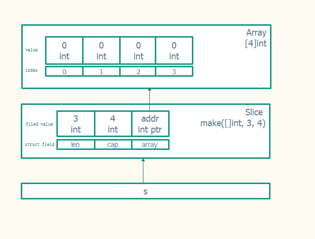

# Go语言切片

Go中的slice依赖于数组，它的底层就是数组，所以数组具有的优点, slice都有。 且slice支持可以通过append向slice中追加元素，长度不够时会动态扩展，通过再次slice切片，可以得到得到更小的slice结构，可以迭代、遍历等

```go
// runtime/slice.go
type slice struct {
    array unsafe.Pointer // 数组指针
    len   int // 长度 
    cap   int // 容量
}
```

每一个slice结构都由3部分组成：
+ 容量(capacity): 即底层数组的长度，表示这个slice目前最多能扩展到这么长
+ 长度(length)：表示slice当前的长度，即当前容纳的元素个数
+ 数组指针(array): 指向底层数组的指针

比如创建一个长度为3，容量为5，int类型的切片

```go
s := make([]int, 3, 4)
fmt.Println(a, len(s), cap(s)) // [0 0 0] 3 5
```




## 切片


切片是长度可变的数组（具有相同数据类型的数据项组成的一组长度可变的序列），切片由
三部分组成：

+ 指针：指向切片第一个元素指向的数组元素的地址
+ 长度：切片元素的数量
+ 容量：切片开始到结束位置元素的数量

### 源码解读

动态增长逻辑: growslice

```go
// growslice handles slice growth during append.
// It is passed the slice element type, the old slice, and the desired new minimum capacity,
// and it returns a new slice with at least that capacity, with the old data
// copied into it.
// The new slice's length is set to the old slice's length,
// NOT to the new requested capacity.
// This is for codegen convenience. The old slice's length is used immediately
// to calculate where to write new values during an append.
// TODO: When the old backend is gone, reconsider this decision.
// The SSA backend might prefer the new length or to return only ptr/cap and save stack space.
func growslice(et *_type, old slice, cap int) slice {
    ...
}
```

1) 声明
切片声明需要指定组成元素的类型，但不需要指定存储元素的数量（长度）。在切片声明后，
会被初始化为 nil，表示暂不存在的切片

2) 初始化
a) 使用字面量初始化:[]type{v1, v2, …, vn}
b) 使用字面量初始化空切片: []type{}
c) 指定长度和容量字面量初始化:[]type{im:vm, in:vn, ilength:vlength}
d) 使用 make 函数初始化
make([]type, len)/make([]type, len, cap)，通过 make 函数创建长度为 len，容量
为 cap 的切片，len 必须小于等于 cap
e) 使用数组切片操作初始化：array[start:end] array[start:end:cap] (end<=cap<=len)

3) 操作
a) 获取切片长度和容量
使用 len 函数可获取切片的长度，使用 cap 函数可获取切片容量

b) 访问和修改
通过对编号对切片元素进行访问和修改，元素的编号从左到右依次为:0, 1, 2, …, n(n
为切片长度-1)

c) 切片: slice[start:end]用于创建一个新的切片，end <= src_cap
新创建切片长度和容量计算：len: end-start, cap: src_cap-start
切片共享底层数组，若某个切片元素发生变化，则数组和其他有共享元素的切片也会发生变化

slice[start:end:cap]可用于限制新切片的容量值, end<=cap<= src_cap
新创建切片长度和容量计算：len: end-start, cap: cap-start

d) 遍历
可以通过 for+len+访问方式或 for-range 方式对切片中元素进行遍历
使用 for-range 遍历切片，range 返回两个元素分别为切片元素索引和值

e) 增加元素
使用 append 对切片增加一个或多个元素并返回修改后切片，当长度在容量范围内时只
增加长度，容量和底层数组不变。当长度超过容量范围则会创建一个新的底层数组并对
容量进行智能运算(元素数量<1024 时，约按原容量 1 倍增加，>1024 时约按原容量 0.25
倍增加)

f) 复制切片到另一个切片
复制元素数量为 src 元素数量和 dest 元素数量的最小值

4) 使用
a) 移除元素

b) 队列
先进先出

c) 堆栈

5) 多维切片
切片的元素也可以是切片类型，此时称为多维切片


先进后出